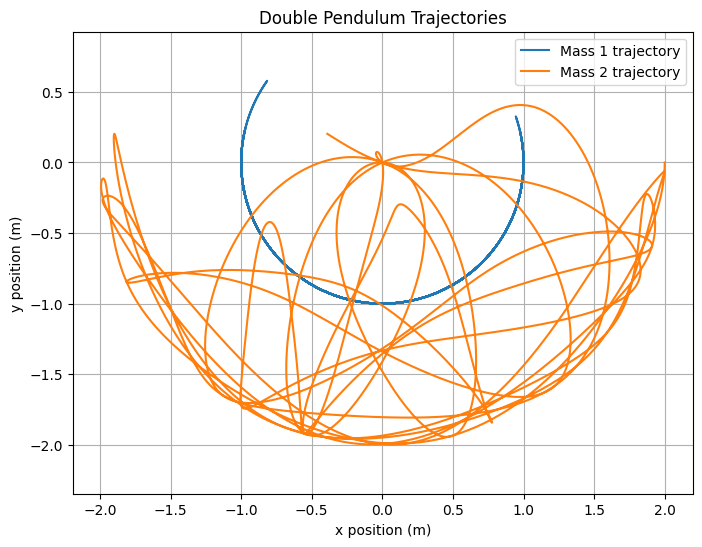

# The Chaos of the Double Pendulum: Simulation, Data Analysis & Dashboard

A physics-to-data-analysis project simulating the motion of a double pendulum, generating real data from the simulation, and building an end-to-end analysis and reporting pipeline on top of it.

The goal of this project is to combine my physics background with the practical data toolkit I've been building: Python for simulation, SQL for analysis, Excel for data cleaning, and Power BI for visualisation. These skills are used to put a single, complete example of turning a raw dataset into a clear, useful output.

## Project Structure

This project is organised to be read in order, from theory through to final output:

1. **[`01-theory`](./01-theory)** — Background on the double pendulum system, the equations of motion, and why its behaviour becomes chaotic under certain initial conditions.
2. **[`02-notebooks`](./02-notebooks)** — Python code that simulates the pendulum's motion and generates the underlying dataset (angles, angular velocities, and positions over time, across a range of initial conditions).
3. **[`03-data`](./03-data)** - Data generated using Python code in Google Colab
4. **[`03-analysis`](./03-analysis)** — SQL queries used to explore and analyse the generated dataset. *(In progress)*
5. **[`04-cleaning`](./04-cleaning)** — Excel-based data cleaning and validation of the dataset ahead of visualisation. *(In progress)*
6. **[`05-dashboard`](./05-dashboard)** — A Power BI dashboard built on the cleaned dataset, visualising key patterns in the pendulum's motion. *(In progress)*

## Where This Project Is Right Now

The theory and simulation stages are complete — the Python simulation runs and generates a real dataset (`.csv`) from the double pendulum's motion, documented in the notebook in `02-notebooks`.

I'm currently extending the project through the analysis, cleaning and dashboard stages, applying SQL, Excel and Power BI to the dataset the simulation produced. I'm building this project specifically to bring together the full set of tools I've been developing, from generating data through to presenting it clearly.

## Why a Double Pendulum

A double pendulum is a simple mechanical system that produces genuinely chaotic motion, small changes in starting angle lead to wildly different outcomes. That made it a good candidate for this project: it's a real physics problem I understand well, but the data it produces is rich enough to be genuinely interesting to explore, clean and visualise, rather than a generic dataset with no context behind it.

## Tools Used

- **Python** (NumPy, Matplotlib) — simulation and data generation
- **SQL** — data exploration and analysis *(in progress)*
- **Excel** — data cleaning and validation *(in progress)*
- **Power BI** — dashboard and visualisation *(in progress)*

## What's Next

- Complete the SQL analysis of the simulation dataset
- Clean and validate the dataset in Excel
- Build the Power BI dashboard
