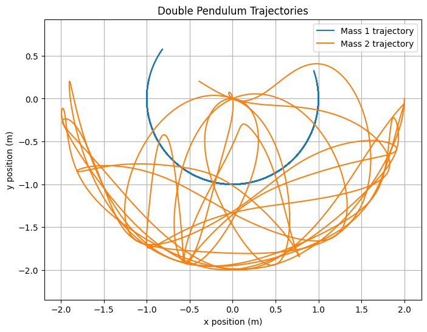

# The Chaos of the Double Pendulum: Simulation, Data Analysis & Dashboard

A physics-to-data-analysis project simulating the motion of a double pendulum, generating data from the simulation, and building an end-to-end analysis and reporting pipeline.

The goal is to combine my physics background with the practical data toolkit I've been developing: Python for simulation, SQL for analysis, Excel for data cleaning, and Power BI for visualisation. Together, these tools demonstrate how a dataset can be generated, explored, prepared and transformed into clear, useful insights.

## Project Structure

This project is organised to be read in order, from the underlying physics through to the final analytical output.

1. **[`01-theory`](./01-theory)** — Background on the double pendulum system, including kinetic and potential energy, Lagrangian mechanics, the equations of motion and numerical solutions.
2. **[`02-notebooks`](./02-notebooks)** — Python simulation and SQL analysis notebooks, with explanations of the methods, code and results.
3. **[`03-data`](./03-data)** — CSV data generated by the Python simulation, including angular positions, angular velocities, pendulum coordinates and energy measurements.
4. **[`04-analysis`](./04-analysis)** — Clean SQL scripts used to query and analyse the simulation dataset.
5. **[`05-cleaning`](./05-cleaning)** — Planned Excel-based data inspection, cleaning, validation and summary analysis.
6. **[`06-dashboard`](./06-dashboard)** — Planned Power BI dashboard presenting key patterns and metrics from the simulation.
7. **[`assets`](./assets)** — Diagrams and visual assets used throughout the project.

## Where This Project Is Right Now

The theory, Python simulation and SQL analysis stages are complete.

The physics documentation derives the equations governing the double pendulum's motion. These equations are implemented in Python to simulate the system and generate a dataset containing 5,000 observations across a 20-second simulation.

The simulation includes visualisations of angular motion and pendulum trajectories, alongside an energy conservation check to assess numerical accuracy.

The resulting CSV dataset has been analysed using DuckDB and SQL. The analysis explores maximum and average angular velocities, maximum angular displacement, changes in angular velocity between the first and second halves of the simulation, and variation in total energy.

The SQL queries are documented in the analysis notebook and organised into a separate SQL script for readability and reuse.

## Why a Double Pendulum

A double pendulum is a simple mechanical system that can exhibit chaotic motion, where small changes in initial conditions can lead to substantially different trajectories over time. This makes it a useful subject for the project: it draws on my physics background while generating data that can be explored through computational methods and analytical tools.

The project also provides an opportunity to investigate how mathematical modelling, numerical simulation and data analysis can work together to understand a complex system.

## Tools Used

* **Python** (NumPy, SciPy, Matplotlib, pandas) — numerical simulation, visualisation and dataset generation
* **SQL** (DuckDB) — data exploration, aggregation and analysis
* **Google Colab** — cloud-based Python development and analysis
* **GitHub and Markdown** — version control and project documentation
* **Excel** — data inspection, cleaning and summary analysis *(planned)*
* **Power BI** — interactive dashboard and visualisation *(planned)*

## What's Next

* **Excel analysis:** Inspect data quality, validate the dataset, calculate summary statistics and create pivot tables and charts.
* **Power BI dashboard:** Build an interactive dashboard showing angular motion over time, differences between the two pendulums and energy conservation.
* **Final documentation:** Add the main findings, selected charts and dashboard screenshots to the README to communicate the results clearly.
